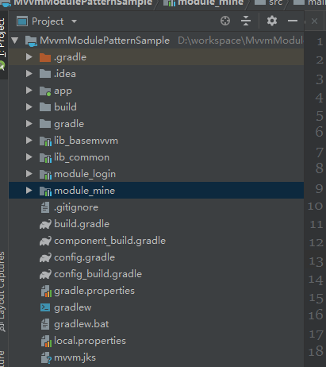

#####  主要技术点 

1. [**Kotlin**](https://www.kotlincn.net/)  
2. [**MVVM**](https://github.com/Dawish/GoogleArchitectureDemo)  
3. [**Databinding**](http://www.jcodecraeer.com/a/anzhuokaifa/androidkaifa/2015/0811/3290.html)  
4. [**Arouter路由**](https://github.com/alibaba/ARouter)  
5. [**Dagger依赖注入**](https://dagger.dev/)  
6. [**Rxjava**](https://github.com/ReactiveX/RxJava)  
7. [**Retrofit**](http://square.github.io/retrofit/)  

**MVVM**：MVVM设计模式的一套快速开发库，整合Okhttp+RxJava+Retrofit+Glide等主流模块，满足日常开发需求。使用该框架可以快速开发一个高质量、易维护的Android应用。

**ARouter**：阿里出的一个用于帮助 Android App 进行组件化改造的框架 —— 支持模块间的路由、通信、解耦。

MVVM + ARouter：MVVM模式 + 组件化方案，前者是设计模式，后者是方案架构，两者并用，相得益彰。有这两个框架作支撑，事半功倍，可快速开发组件化应用。

> ps:具体的技能点使用这里就不讲解的

## 项目整体模块  
如图:

- **app** `关于app的入口module`  
- **lib_basemvvm** `整个项目的底层mvvm封装,并不涉及到项目相关的任何业务代码`  
- **lib_common** `关于项目公用的业务代码`  
- **module_login** `登录模块`  
- **module_mine** `我的模块`  

## 项目MVVM结构

- **core** `存放Application类的相关代码,比如Activity/Fragment生命周期监听。`  
- **di** `存放dagger注入的相关代码`  
	- **component** `提供需要注入的桥梁`  
	- **module** `提供需要注入的实体`
		- **AppModule** `提供App需要的单例类,比如网络请求/数据库`
		- **ActivityModule** `提供Activity类`
		- **FragmentModule** `提供Fragment类`
		- **ViewModelModule** `提供ViewModel类`
- **mvvm**
	- **view** `主要是activity和fragment`
	- **viewmodel** `所有的viewmodel`
	- **model**`这里主要还是网络的请求apiservice,其实是省略了model模块`

	
 

MVVM可以看作是一种特殊的MVP（Passive View）模式，或者说是对MVP模式的一种改良。

MVVM代表的是Model-View-ViewModel，这里需要解释一下什么是ViewModel。ViewModel的含义就是 "Model of View"，视图的模型。它的含义包含了领域模型（Domain Model）和视图的状态（State）。 在图形界面应用程序当中，界面所提供的信息可能不仅仅包含应用程序的领域模型。还可能包含一些领域模型不包含的视图状态，例如电子表格程序上需要显示当前排序的状态是顺序的还是逆序的，而这是Domain Model所不包含的，但也是需要显示的信息。

可以简单把ViewModel理解为页面上所显示内容的数据抽象，和Domain Model不一样，ViewModel更适合用来描述View。

## 项目gralde文件说明

**config.gradle =>三方依赖库和版本管理，统一放在该文件中**
 
**config_build.gradle =>整个项目(app/module) 通用的gradle配置。**

**component_build.gradle =>组件化开关的配置,lib和application的切换以及清单文件的配置**
 
component_build代码如下:

    if (isBuildModule.toBoolean()) {
    	apply plugin: 'com.android.application'
    } else {
    	apply plugin: 'com.android.library'
    }
    apply from: "../config_build.gradle"
    
    android {
    //这里进行设置使用单独运行还是合并运行的Manifest.xml
    sourceSets {
     main {
    	  jniLibs.srcDirs = ['libs']
      if (isBuildModule.toBoolean()) {
    	  manifest.srcFile 'src/main/debug/AndroidManifest.xml'
        } else {
    	   manifest.srcFile 'src/main/release/AndroidManifest.xml'
    	}
      }
     }
    }

## productFlavor配置

公司采用jenkins打包,配置三种类型productFlavor,方便提测和发版,一种开发环境,一种测试环境,一种正式环境,这样通过不同的命令行即可打包不同环境的apk
 

    productFlavors {
     
     versionDev{
    	dimension "verison"
    	buildConfigField "boolean","VERSION_ONLINE", "false"
    	buildConfigField "boolean","VERSION_TEST", "false"
    	//manifestPlaceholders = rootProject.ext.debugPlaceholders
    }
     
     versionTest {
    	dimension "verison"
    	buildConfigField "boolean","VERSION_ONLINE", "false"
    	buildConfigField "boolean","VERSION_TEST", "true"
    	//manifestPlaceholders = rootProject.ext.debugPlaceholders
    }
    
     versionOnline{
    	dimension "verison"
    	buildConfigField "boolean","VERSION_ONLINE", "true"
    	buildConfigField "boolean","VERSION_TEST", "true"
    	//manifestPlaceholders = rootProject.ext.releasePlaceholders
     }
    }

 

打包命令行:

    * 1,开发环境打包  gradlew clean assembleVersionDevDebug或者gradlew clean assembleVersionDevRealease
    * 2,测试环境打包  gradlew clean assembleVersionTestDebug或者gradlew clean assembleVersionTestRealease
    * 3,正式环境打包 gradlew clean assembleVersionOnlineRelease

代码配置:

    object HttpUrlConstants {
    //开发环境
    private const val DEV_BASE_URL = "https://wanandroid.com/dev"
    //测试环境
    private const val TEST_BASE_URL = "https://wanandroid.com/test"
    //正式环境
    private const val RELIASE_BASE_URL = "https://wanandroid.com/online"
	//获取bse_url
    fun getBaseUrl(): String = if (BuildConfig.VERSION_ONLINE) RELIASE_BASE_URL else{
            if (BuildConfig.VERSION_TEST) TEST_BASE_URL  else DEV_BASE_URL
    }

 

## 每个模块的配置
**gradle配置**

每个模块的gradle文件需要引入公共的component_build.gradle,并且需要配置productFlavors,另外还需要统一资源前缀,不然打包容易出现资源冲突

例如login模块的gradle文件

    apply from: "../component_build.gradle"

    android {
    resourcePrefix "login_" //给 Module 内的资源名增加前缀, 避免资源名冲突
    flavorDimensions "verison"
    productFlavors {
    
        versionDev{
            dimension "verison"
        }
      
        versionTest {
            dimension "verison"
        }
       
        versionOnline{
            dimension "verison"
        }
     }
    }

    dependencies {
    	implementation fileTree(include: ['*.jar'], dir: 'libs')
    }

 

**manifest配置**

组件在自己的AndroidManifest.xml各自配置，application标签无需添加属性，也不需要指定activity的intent-filter。当合并打包时，gradle会将每个组件的AndroidManifest合并到宿主App中。

文件位置:`src/main/release/AndroidManifest.xml`

	<manifest xmlns:android="http://schemas.android.com/apk/res/android"
		  package="com.mou.login">
	<application>
		<meta-data
				android:name="com.mou.login.core.GlobalConfiguration"
				android:value="ConfigModule"/>

		<activity android:name=".mvvm.view.LoginActivity"
				  android:label="登录"
				  android:screenOrientation="portrait"/>
	</application>
	</manifest>

组件独立运行时，就需要单独的一个AndroidManifest.xml作为调试用。

文件位置:`src/main/debug/AndroidManifest.xml`

	<manifest xmlns:android="http://schemas.android.com/apk/res/android"
		  package="com.mou.login">
	<application
			android:name=".core.App">
		<!-- 每个业务组件需要声明两个 ConfigModule, CommonSDK 的 ConfigModule 和 业务组件自己的 ConfigModule
        CommonSDK 的 ConfigModule 含有有每个组件都可共用的配置信息, 业务组件自己的 ConfigModule 含有自己独有的配置
        信息, 这样即可重用代码, 又可以允许每个组件可自行管理自己独有的配置信息, 如果业务组件没有独有的配置信息则只需要
        声明 CommonSDK 的 ConfigModule -->
		<meta-data
				android:name="com.fortunes.commonsdk.core.GlobalConfiguration"
				android:value="ConfigModule" />
		<meta-data
				android:name="com.mou.login.core.GlobalConfiguration"
				android:value="ConfigModule" />
		<meta-data
				android:name="design_width_in_dp"
				android:value="360"/>
		<meta-data
				android:name="design_height_in_dp"
				android:value="640"/>

		<activity android:name=".mvvm.view.LoginActivity">
			<intent-filter>
				<action android:name="android.intent.action.MAIN"/>
				<category android:name="android.intent.category.LAUNCHER"/>
			</intent-filter>
		</activity>
	</application>
	</manifest>

每个模块独立运行后如图:

## 组件间通信
##### ARouter
ARouter是阿里巴巴出品的路由框架,可以实现各组件之间的通信

编写一个工具类进行路由跳转

	object NavigationUtils {

    /**
     * 去往登录页面
     */
    fun goLoginActivity() {
        ARouter.getInstance().build(RouterConstants.LOGIN_ACTIVITY).navigation()
    }

    /**
     * 去往首页
     */
    fun goMainActivity() {
        ARouter.getInstance().build(RouterConstants.MAIN_ACTIVITY).navigation()
    }

    /**
     * 去往WebView页面
     * url:加载的网址
     * title:加载的标题
     */
    const val WEB_URL = "url"
    const val WEB_TITLE = "title"
    fun goWebActivity(url: String, title: String) {
        ARouter.getInstance().build(RouterConstants.WEB_ACTIVITY)
                .withString(WEB_URL, url)
                .withString(WEB_TITLE, title)
                .navigation()
    }

	}

## 如何使用
以MainActivity为例
1,创建MainActivity

	@Route(path = RouterConstants.MAIN_ACTIVITY)
	class MainActivity : BaseActivity<ActivityMainBinding>() {
    override fun getLayoutId() = R.layout.activity_main
    private val mViewModel by lazy {
        createVM(MainViewModel::class.java)
    }

    override fun initView() {
        //设置viewModel
        mBinding.apply {
            vm=mViewModel
        }
        btn.setOnClickListener {
            mViewModel
                .getArticle()
                .bindDialogOrLifeCycle(this)
                .onHttpSubscribeNoToast(this) {
                    toast("成功")
                }
        }
        btn_login.setOnClickListener {
            NavigationUtils.goLoginActivity()
        }

        btn_mine.setOnClickListener {
            NavigationUtils.goMineActivity()
        }
    }

    override fun initData() {
    }
	}
2,编写xml文件

	<?xml version="1.0" encoding="utf-8"?>
	<layout xmlns:android="http://schemas.android.com/apk/res/android"
		xmlns:app="http://schemas.android.com/apk/res-auto">
	<data>
		<variable name="vm" type="com.mou.mvvmmodule.di.mvvm.viewmodel.MainViewModel"/>
	</data>
	<com.fortunes.commonsdk.view.toolbar.MyToolBarLayout
			android:layout_width="match_parent"
			android:layout_height="match_parent"
			android:orientation="vertical"
			app:public_toolbar_img="false"
			app:public_toolbar_title="首页">

		<Button
				android:id="@+id/btn"
				android:text="请求"
				android:layout_width="match_parent"
				android:layout_height="wrap_content"/>

		<Button
				android:id="@+id/btn_login"
				android:text="去登录页"
				android:layout_width="match_parent"
				android:layout_height="wrap_content"/>
		<Button
				android:id="@+id/btn_mine"
				android:text="去个人中心"
				android:layout_width="match_parent"
				android:layout_height="wrap_content"/>

		<TextView
				android:layout_width="match_parent"
				android:layout_height="wrap_content"
		/>
		<TextView
				android:textColor="@color/black"
				android:text="@{vm.chapterName}"
				android:layout_width="match_parent"
				android:layout_height="wrap_content"
		/>
		<TextView
				android:textColor="@color/black"
				android:text="@{vm.link}"
				android:layout_width="match_parent"
				android:layout_height="wrap_content"
		/>
	</com.fortunes.commonsdk.view.toolbar.MyToolBarLayout>
	</layout>

3,在ActivityModule中提供dagger需要Activity的注入的实例

	@Module
	abstract class ActivityModule {
    	 @ContributesAndroidInjector
    	abstract fun contributeMainActivity(): MainActivity
	}

4,创建viewModel

	class MainViewModel @Inject constructor(private val apiService: ApiService) : BaseViewModel() {
    	val chapterName = ObservableItemField<String>()
    	val link = ObservableItemField<String>()

    fun getArticle(): Single<BaseBean<ArticleBean>> {
        return apiService
            .getArticle()
            .async()
            .doOnSuccess {
                chapterName.set(it.data.datas[0].chapterName)
                link.set(it.data.datas[0].link)
            }
            .doOnError {
                Timber.d("doOnError")
            }
    }
}

4,然后在ViewModelModule中提供dagger需要ViewModel的注入的实例

	@Module
	abstract class ViewModelModule {

    	@Binds
    	@IntoMap
    	@ViewModelKey(MainViewModel::class)
    	abstract fun bindMainViewModel(viewModel: MainViewModel): ViewModel
	}

这样就基本完成了一个activity的配置,就可以进行api调用和后续的数据绑定了

具体的sample地址如下:

[https://github.com/mouxuefei/MvvmModulePatternSample](https://github.com/mouxuefei/MvvmModulePatternSample). 

